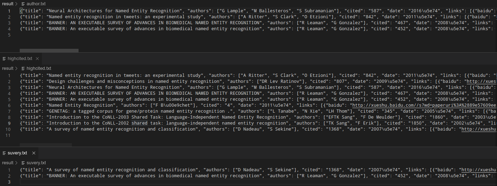

# paperassist
A scientific assistant collecting academic papers.

===
# Features
1. It provides a keyword to get a volume of papers in the field.
2. It can help novices to quickly understand the research status and development history of **a certain field**, which is of great help to **the writing of literature review and the introductory study** of graduate students.
3. we can use the post_process.py to find **survey papers** or **somebody's papers** or **high cited papers**.

# Modules

## 1. Baidu scholar

```shell
scrapy runspider -a keyword='named entity recognition' -a number=10 -a sort_key=0 -o baidu_papers.json baidu.py
```


## 2. Google scholar

```shell
scrapy runspider -a keyword='named entity recognition' -a number=10 -a sort_key=0 -o google_papers.json google.
py
```


## 3. post process
```shell
python post_process.py -f baidu_papers.json -a 'G Lample','A Ritter','R Leaman'
```


